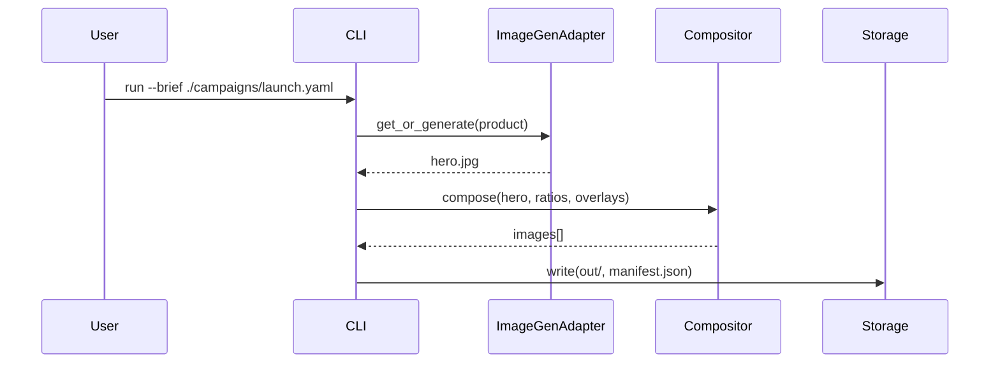

# Lean-Clean PoC Playbook – {{project_name}}
**Version:** v2  
**Owner:** {{owner_name}}  
**Date:** {{YYYY-MM-DD}}  
**Timebox:** {{6-8}} hours  
**Tags:** poc, lean, clean-architecture, agent-ready

---

## Executive Summary
> Summarize the business goal, steel thread, and success signal in 3–5 sentences.

- **Problem / Opportunity:** {{one-sentence}}
- **Steel Thread (minimal end-to-end):** {{one-sentence}}
- **Success Criteria:** {{bullets}}
- **Deliverables:** demo recording, slides, README, repo
- **Constraints:** {{timebox_hours}}h; local-first; minimal dependencies

---

## 0. Scenario & Constraint Playbook
> Copy key facts from the PDF here; keep terse and testable.

### 0.1 Goals
- {{goal_1}}
- {{goal_2}}

### 0.2 Success Metrics (proxies OK)
- **Outcome metric:** {{e.g., 3 aspect ratios per product}}
- **Quality proxy:** {{e.g., text contrast heuristic passes}}
- **Throughput proxy:** {{e.g., one command generates all variants}}

### 0.3 Constraints & Assumptions
- **Timebox:** {{timebox_hours}}h
- **Tooling:** {{Python, CLI, FastAPI, etc.}}
- **Data/Access:** {{local assets, no external DB}}
- **Assumptions:** {{list}}

### 0.4 Stakeholders & Audiences
| Role | Need |
|------|------|
| {{role}} | {{need}} |
| {{role}} | {{need}} |

### 0.5 Out of Scope (v1 PoC)
- {{bullet}}
- {{bullet}}

---

## 1. Decomposition & Instruction Distillation
> Reduce to atomic elements and minimal instructions (implementation-agnostic).

### 1.1 Domain Elements
- **Entities:** `CampaignBrief`, `AssetInventory`, `BrandRules`, `OutputArtifact`
- **Events:** `BriefIngested`, `ImageGenerated`, `VariantComposed`, `OutputsSaved`
- **Relationships:** brief ↔ assets ↔ generator ↔ compositor ↔ storage

### 1.2 I/O Map (Inputs → Processes → Outputs)
| Input | Process | Output |
|--------|----------|---------|
| brief.yaml | validate | validated brief |
| assets/ | locate_or_generate | hero image |
| brand/logo | compose | final creative |
| — | write_outputs | manifest + logs |

### 1.3 Instruction Distillation (copyable for agents)
```text
Given a campaign brief with {products[], region, audience, message}:
1) For each product, locate a hero image; if missing, request/generate one.
2) For each required aspect ratio, compose: base image + message + logo/color.
3) Save under ./out/{product}/{ratio}/ and write a manifest with metadata.
```

### 1.4 Unknowns → Experiments
- {{e.g., image quality variance}}
- {{e.g., text overlay legibility rules}}

---

## 2. Ideation & Concept Design

### 2.1 Patterns Considered
- **Pattern A (CLI-first):** Pros {{…}} / Cons {{…}}
- **Pattern B (Minimal Web UI):** Pros {{…}} / Cons {{…}}
- **Pattern C (Worker-first):** Pros {{…}} / Cons {{…}}

### 2.2 Pros/Cons Matrix
| Pattern | Pros | Cons |
|----------|------|------|
| CLI-first | {{…}} | {{…}} |
| Minimal UI | {{…}} | {{…}} |
| Worker-first | {{…}} | {{…}} |

---

## 3. Refinement & Steel Thread Definition

### 3.1 Steel Thread (Chosen)
- Entry: `CLI`
- Storage: `LocalFS (adapter-ready)`
- Image Provider: `Single provider wrapper`
- Ratios: `1:1`, `9:16`, `16:9`
- Overlays: `message text + logo + brand color`

### 3.2 Decision Matrix
| Decision | Option | Rationale |
|-----------|---------|------------|
| Entry point | CLI | speed, simplicity |
| Storage | Local FS | demo-friendly, extensible |
| Provider | {{ProviderName}} | swap-ability |
| Localization | EN only | scope control |

### 3.3 Sequence Diagram


---

## 4. Roadmapping & Epic Definition

### 4.1 Epics
| Epic | Description |
|-------|--------------|
| E1 – Ingestion | parse brief, validate schema, scan assets |
| E2 – Generation Adapter | image provider client, retry/backoff |
| E3 – Composition | resize, text overlay, logo, palette |
| E4 – Storage & Manifests | output tree, manifest, logs |
| E5 – QA & Docs | validation checklist, README, demo script |

### 4.2 Dependency Matrix
| Task | Depends On | Notes |
|------|-------------|-------|
| Brief validator | — | {{…}} |
| Asset scanner | validator | {{…}} |
| ImageGen adapter | validator | {{…}} |
| Compositor | scanner, adapter | {{…}} |
| Manifest writer | compositor | {{…}} |

---

## 5. Implementation Planning & Executable Specs

### 5.1 Technical Decision Log
| Area | Decision | Reason |
|-------|-----------|--------|
| Language | Python | fast to prototype |
| Framework | FastAPI / CLI | minimal setup |
| Storage | Local FS | demo simplicity |
| Provider | {{OpenAI/Firefly/etc}} | available, simple auth |

### 5.2 YAML Use-Case Spec
```yaml
use_case: generate_social_creatives
version: 0.1
inputs:
  brief_path: "./campaigns/launch.yaml"
  assets_root: "./assets"
  out_root: "./out"
  aspect_ratios: ["1:1", "9:16", "16:9"]
  brand:
    logo_path: "./brand/logo.png"
    primary_color_hex: "#E60023"
    font_family: "Inter"
steps:
  - ensure_brief_is_valid
  - locate_or_generate_hero_image_per_product
  - compose_variants_with_text_and_logo
  - write_outputs_and_manifest
acceptance_criteria:
  - "3 images per product exist under out/{product}/{ratio}/"
  - "Message text is legible (contrast heuristic passes)"
  - "manifest.json includes timestamps + output paths"
```

### 5.3 Validation Checklist
- [ ] Brief parsed; ≥2 products
- [ ] All aspect ratios generated
- [ ] Text overlay legible; logo visible
- [ ] Outputs organized correctly
- [ ] manifest.json + log exist

---

## 6. Execution & Iteration
- Commit per epic; document decisions in README.
- Record demo video (show commands + outputs).
- Capture lessons and timing data.

---

## 7. Reflection & Knowledge Capture
| Category | Insight |
|-----------|----------|
| What worked | {{…}} |
| What didn’t | {{…}} |
| Improvements | {{…}} |

---

## Appendix A – Slide Deck Outline
1. Title & Context  
2. Problem & Goals  
3. Architecture (High-Level)  
4. Steel Thread  
5. Executable Specs (YAML)  
6. Sequence & Decisions  
7. Demo Walkthrough  
8. Roadmap & Epics  
9. Risks & Mitigations  
10. Next Steps & Q&A

---

## Appendix B – Demo Script
1. Show `./campaigns/launch.yaml` and `/assets/`
2. Run `python -m app.cli run --brief ./campaigns/launch.yaml`
3. Narrate: ingest → generate → compose → store
4. Display outputs and manifest
5. Call out known issues
6. Close with next steps

---

## Appendix C – Risk Register
| Risk | Likelihood | Impact | Mitigation |
|------|-------------|---------|-------------|
| API quota | Med | High | Retry/backoff; alternate provider |
| Brand compliance | Med | Med | Contrast heuristic |
| Image quality | Med | Med | Prompt tuning |
| Timebox overrun | Low | High | Strict scope |

---

## Appendix D – Acceptance Test Plan
- **Schema validation:** reject invalid brief  
- **Asset reuse:** hero present → skip gen  
- **Composition:** all ratios present + contrast check  
- **Output structure:** manifests in correct folders  
- **Negative path:** retries logged

---

## Appendix E – Model Context Protocol (Agent Alerts)
```yaml
mcp:
  brief_metadata:
    id: "launch-2025-10"
    products: ["SparkleWater", "GlowSoda"]
    target_region: "US"
    target_audience: "GenZ"
    message: "Refresh your day."
  asset_inventory:
    SparkleWater: { hero_found: true, path: "./assets/sparkle.jpg" }
    GlowSoda: { hero_found: false }
  generation_requirements:
    aspect_ratios: ["1:1", "9:16", "16:9"]
    min_variants_per_product: 3
  status_snapshot:
    SparkleWater: { generated: 3 }
    GlowSoda: { generated: 2 }
  policy:
    alert_if_missing_variants: true
    channel: "email"
  render_for_humans:
    include_counts: true
    include_paths: true
```

---

## Appendix F – PDF Integration Scratchpad
> Paste relevant excerpts from the provided PDF here; map them to goals, constraints, or criteria.

- **Highlights:** {{bullets}}
- **Mapped To Section(s):** {{references}}

---

## Changelog
- {{YYYY-MM-DD}} – v2 markdown template created for Lean-Clean PoC Playbook.
