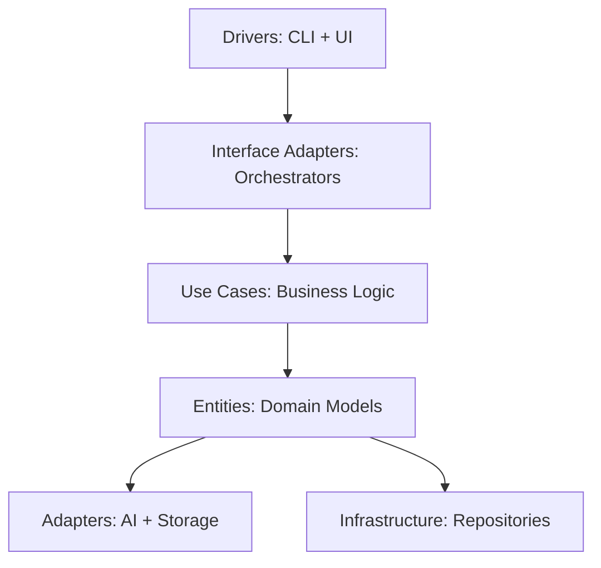

# Session 01: Architecture Diagram & Roadmap (Task 1)

**FDE Take-Home Exercise - Campaign Generator**
**Task:** Create architecture diagram and implementation roadmap
**Duration:** 2-3 hours
**Deliverable:** Architecture diagram + 1-slide roadmap (PDF requirement)

---

## Session Goals

By the end of this session, you will have:
- ✅ Visual architecture diagram (Pragmatic Clean Architecture)
- ✅ 10-week implementation roadmap (5 phases, 25 epics)
- ✅ Presentation slides updated (Slides 4 & 6)
- ✅ Task 1 deliverable ready for PDF export

---

## Prerequisites

**Completed (Previous Session):**
- [x] All 13 architectural decisions resolved (`_decisions-needed.md`)
- [x] Domain model defined (`entities.md`)
- [x] Use cases specified (`use-cases.md`)
- [x] Function composition documented (`function-composition.md`)
- [x] Campaign brief schema created (`campaign-brief-schema.yaml`)
- [x] Presentation outline created (`presentation.md`)

**Required Files (Read First):**
1. `_decisions-needed.md` - Technology stack and architecture choices
2. `entities.md` - 6 core entities with Python code
3. `use-cases.md` - 3 use cases (Understand Brand, Generate Campaign, Validate Campaign)
4. `function-composition.md` - 15+ pipeline functions
5. `architecture-diagram.md` - Textual architecture (already created)
6. `roadmap.md` - 10-week plan (already created)

---

## Task 1 Overview

**PDF Requirement (from `_scenario-context.md`):**
> **Task 1: Architecture Diagram & Implementation Roadmap**
> - Include a high-level architecture diagram showing key components
> - Provide an implementation roadmap (phases, timelines, and key deliverables)
> - Format: 1-2 slides suitable for inclusion in a presentation deck

**Our Approach:**
- Architecture diagram: Pragmatic Clean Architecture (5 layers)
- Roadmap: 10-week plan, 5 phases, 25 epics
- Presentation integration: Update Slides 4 & 6

---

## Step 1: Review Architecture Diagram

**File:** `architecture-diagram.md` (already created in previous commit)

### What's in the Document

**Section 1: High-Level Architecture (5 Layers)**
```
Layer 5: DRIVERS (CLI + Streamlit)
    ↓
Layer 4: INTERFACE ADAPTERS (Orchestrators + Presenters)
    ↓
Layer 3: USE CASES (Business Logic)
    ↓
Layer 2: ENTITIES (Domain Models)
    ↓
Layer 1: ADAPTERS & INFRASTRUCTURE (External Services + Persistence)
```

**Section 2: Data Flow (Campaign Generation Pipeline)**
- Input → Brand Understanding → Localization → Generation → Validation → Approval → Output
- Shows 8 steps from YAML brief to organized asset output

**Section 3: Technology Integration Map**
- Drivers: Typer CLI, Streamlit UI
- Use Cases: Pure Python logic
- Entities: Python dataclasses
- Adapters: OpenAI API, Claude API, Fake adapters
- Infrastructure: MinIO, Weaviate, YAML files

**Section 4: Adapter Pattern Example**
- Shows how IAIAdapter interface enables AI service substitution
- Fake → OpenAI → Claude switching without use case changes

**Section 5: Folder Structure**
- Maps Pragmatic CA layers to actual project folders
- Shows file organization (entities, use cases, adapters, drivers)

### Your Tasks

**Action 1.1: Read Architecture Diagram**
```bash
# Read the full document
cat plan/sessions/campaign-generator/architecture-diagram.md
```

**Action 1.2: Validate Against Decisions**
Cross-reference with `_decisions-needed.md`:
- Decision 1: Pragmatic CA → ✅ 5-layer structure
- Decision 2: Local storage with adapter → ✅ IStorageAdapter shown
- Decision 3: Dual AI implementation → ✅ Fake + Real adapters
- Decision 11: CLI + UI → ✅ Both in Drivers layer

**Action 1.3: Identify Presentation Elements**
Decide which diagrams to convert to visual format:
1. **High-level 5-layer architecture** (primary visual)
2. **Data flow diagram** (campaign generation pipeline)
3. **Adapter pattern example** (AI service substitution)
4. **Technology integration map** (tech stack)

---

## Step 2: Review Implementation Roadmap

**File:** `roadmap.md` (already created in previous commit)

### What's in the Document

**Section 1: 5-Phase Overview**
- Phase 1: Foundation (Weeks 1-2) - Entities, CLI, fakes
- Phase 2: AI Integration (Weeks 3-4) - OpenAI + Claude APIs
- Phase 3: Intelligence (Weeks 5-6) - Weaviate, asset reuse
- Phase 4: Production (Weeks 7-8) - Streamlit, MinIO, testing
- Phase 5: Agentic System (Weeks 9-10) - Monitoring, alerts

**Section 2: Epic Breakdown (25 Epics Total)**
Each phase has 4-5 epics with:
- Duration (days)
- Owner (Engineer 1/2/3)
- Dependencies
- Acceptance criteria
- Deliverables

**Section 3: Dependency Map**
Shows critical path:
- Epic 1.1 (Entities) → 2.5 (Use Cases) → 3.5 (Orchestrator) → 4.3 (Logging) → 5.3 (Model Context)

**Section 4: Resource Allocation**
- Engineer 1: Backend/AI (OpenAI, Claude, Weaviate)
- Engineer 2: Full-stack (CLI, UI, Orchestrator)
- Engineer 3 (part-time): DevOps (Docker, deployment)
- Product Owner: Requirements, stakeholder demos

**Section 5: Risk Assessment**
- High: AI API rate limits, Weaviate learning curve, prompt engineering
- Medium: Streamlit scope creep, multi-locale testing

**Section 6: Success Metrics**
- Phase milestones (e.g., "Generate 12 assets in <5 min")
- Quality metrics (e.g., "Asset reuse reduces API calls 30%+")

**Section 7: 1-Slide PDF Summary**
- Compact 1-page version for presentation Slide 6

### Your Tasks

**Action 2.1: Read Roadmap**
```bash
# Read the full document
cat plan/sessions/campaign-generator/roadmap.md
```

**Action 2.2: Validate Against Scope**
Check that roadmap covers all PDF requirements:
- ✅ Multi-product support (Phase 1: entities)
- ✅ Multi-locale support (Phase 2: localization)
- ✅ Multi-aspect ratio (Phase 1-2: generation logic)
- ✅ Asset reuse (Phase 3: Weaviate)
- ✅ Brand understanding (Phase 2: Claude Vision)
- ✅ Validation (Phase 3: legal + compliance)
- ✅ Monitoring/alerting (Phase 5: agentic system)

**Action 2.3: Adjust Timeline (Optional)**
If 10 weeks is too long for interview context:
- Option 1: Keep detailed plan, note "PoC completes Phase 2" (4 weeks)
- Option 2: Compress to 6 weeks (2 weeks/phase for Phases 1-3 only)
- Option 3: Keep as-is (demonstrates full production thinking)

**Recommendation:** Keep 10-week plan, note that Task 2 PoC implements Phases 1-2 only

---

## Step 3: Convert to Visual Diagrams

**Tools:** Draw.io, Lucidchart, PowerPoint, Keynote, or Mermaid

### Diagram 1: High-Level Architecture (Primary)

**Source:** `architecture-diagram.md` Section 1

**Visual Style:**
- Concentric circles (Martin's CA style) OR
- Layered boxes with arrows (nikolovlazar style)

**Elements to Include:**
1. 5 layers clearly labeled
2. Dependency arrows pointing inward
3. Example components in each layer
4. Technology labels (OpenAI, Claude, Weaviate, etc.)

**Recommended Tool:** Draw.io or PowerPoint
- Use boxes for layers, arrows for dependencies
- Color-code layers (blue = drivers, green = use cases, etc.)
- Add icons for technologies (OpenAI logo, Python logo)

**Example Layout:**
```
┌─────────────────────────────────────────────────┐
│        DRIVERS                                  │
│        CLI (Typer) | Streamlit UI               │
└───────────────────┬─────────────────────────────┘
                    │
┌───────────────────▼─────────────────────────────┐
│        INTERFACE ADAPTERS                       │
│        Orchestrators | Presenters               │
└───────────────────┬─────────────────────────────┘
                    │
┌───────────────────▼─────────────────────────────┐
│        USE CASES                                │
│        Understand | Generate | Validate         │
└───────────────────┬─────────────────────────────┘
                    │
┌───────────────────▼─────────────────────────────┐
│        ENTITIES                                 │
│        Brand | Campaign | Asset | Alert         │
└───────────────────┬─────────────────────────────┘
                    │
┌───────────────────▼─────────────────────────────┐
│        ADAPTERS & INFRASTRUCTURE                │
│        AI | Storage | Repositories              │
└─────────────────────────────────────────────────┘
```

### Diagram 2: Data Flow (Campaign Pipeline)

**Source:** `architecture-diagram.md` Section 2

**Visual Style:**
- Horizontal flow (left to right)
- Swim lanes for different components

**Elements to Include:**
1. Input: Campaign Brief YAML
2. Step 1: Brand Understanding (Claude Vision)
3. Step 2: Localization (Claude Multilingual)
4. Step 3: Generation (OpenAI DALL-E 3)
5. Step 4: Validation (Legal + Compliance)
6. Step 5: Approval (Logged checkpoints)
7. Output: Organized asset folders
8. Step 6: Monitoring (Task 3 alerts)

**Recommended Tool:** Lucidchart or Mermaid
- Flowchart with decision diamonds
- Highlight AI service integrations
- Show data transformations (YAML → Entity → Asset)

### Diagram 3: Roadmap Gantt Chart (Optional)

**Source:** `roadmap.md` Section 1

**Visual Style:**
- Gantt chart or timeline
- Color-coded phases

**Elements to Include:**
1. 10-week timeline (X-axis)
2. 5 phases as horizontal bars
3. Key milestones marked
4. Legend for status (✅ Complete, 🔄 In Progress, 📅 Planned)

**Recommended Tool:** PowerPoint timeline feature or Excel

---

## Step 4: Update Presentation Slides

**File:** `presentation.md`

### Slide 4: Architecture Diagram

**Current Content (from presentation.md):**
```markdown
## Slide 4: Architecture Diagram (3 min)

**System Architecture:** Pragmatic Clean Architecture

[ASCII diagram of 5 layers]

**📝 Update:** Add actual architecture diagram from `architecture-diagram.md` when completed
```

**Action 4.1: Replace ASCII with Visual**
1. Export Diagram 1 (High-Level Architecture) as PNG/SVG
2. Insert into presentation slide
3. Add 3 bullet points:
   - "5 layers with clear separation of concerns"
   - "Adapter pattern enables AI service substitution"
   - "Testable via fakes, production-ready via real adapters"

**Action 4.2: Add Speaker Notes**
```markdown
**Speaker Notes for Slide 4:**
- Point to each layer, explain purpose (30 sec)
- Highlight dependency rule: outer depends on inner (20 sec)
- Show adapter pattern example: Fake → OpenAI switching (30 sec)
- Emphasize testability and production evolution (20 sec)
- Transition: "This architecture enables the 10-week roadmap..." (10 sec)
```

### Slide 6: Implementation Roadmap

**Current Content (from presentation.md):**
```markdown
## Slide 6: Implementation Roadmap (2 min)

**Phase 1: Foundation** (Week 1-2)
[Bullet points for each phase]

**📝 Update:** Refine roadmap with actual sprint breakdown from `roadmap.md`
```

**Action 4.3: Use 1-Slide Summary from roadmap.md**
1. Copy Section 7 from `roadmap.md` (1-Slide PDF Summary)
2. Paste into presentation Slide 6
3. Convert ASCII timeline to visual bar chart (optional)

**Action 4.4: Add Speaker Notes**
```markdown
**Speaker Notes for Slide 6:**
- "10-week plan, 5 phases, ~400 engineering hours" (10 sec)
- Point to Phase 1-2: "PoC delivers these first two phases" (20 sec)
- Highlight Phase 3: "Intelligent asset reuse with Weaviate" (15 sec)
- Mention Phase 5: "Agentic system for Task 3" (15 sec)
- Address risks: "AI rate limits and prompt quality mitigated" (20 sec)
- Transition: "Let me show you the working PoC..." (10 sec)
```

---

## Step 5: Create PDF Deliverable

**Requirement:** 1-2 slides for Task 1

### Option 1: Export from Presentation

**Steps:**
1. Open `presentation.md` in PowerPoint/Keynote
2. Convert Slides 4 & 6 to visual slides
3. Export Slides 4-6 as PDF: `task-01-architecture-roadmap.pdf`

### Option 2: Create Standalone Document

**Tool:** Google Slides, PowerPoint, or LaTeX

**Slide 1: Architecture Diagram**
- Title: "Campaign Generator: System Architecture"
- Visual: High-level 5-layer diagram
- Subtitle: "Pragmatic Clean Architecture with AI Integration"
- Footer: "FDE Take-Home Exercise - Task 1"

**Slide 2: Implementation Roadmap**
- Title: "10-Week Implementation Roadmap"
- Visual: 1-slide summary from `roadmap.md`
- Key metrics: "5 Phases | 25 Epics | ~400 Hours"
- Footer: "FDE Take-Home Exercise - Task 1"

---

## Step 6: Quality Checks

### Checklist: Architecture Diagram

- [ ] All 5 layers clearly labeled
- [ ] Dependency arrows point inward (toward entities)
- [ ] Technology stack visible (OpenAI, Claude, Weaviate, etc.)
- [ ] Adapter pattern explained (Fake vs Real)
- [ ] Visual is clean and professional (not cluttered)
- [ ] Font size readable in presentation context

### Checklist: Roadmap

- [ ] 5 phases clearly delineated
- [ ] Timeline shows 10 weeks
- [ ] Key milestones marked for each phase
- [ ] Risks identified with mitigations
- [ ] Success metrics defined
- [ ] PoC scope clarified (Phases 1-2)

### Checklist: Presentation Integration

- [ ] Slide 4 updated with architecture diagram
- [ ] Slide 6 updated with roadmap
- [ ] Speaker notes added for both slides
- [ ] Timing fits (3 min for Slide 4, 2 min for Slide 6)
- [ ] Transitions smooth between slides

### Checklist: PDF Deliverable

- [ ] PDF contains 1-2 slides
- [ ] Visuals are high-resolution (no pixelation)
- [ ] Text is legible (minimum 18pt font)
- [ ] Branding/footer includes "FDE Take-Home Exercise"
- [ ] File named clearly: `task-01-architecture-roadmap.pdf`

---

## Step 7: Commit and Document

**Action 7.1: Update presentation.md**

Edit `presentation.md`:
- Mark Slide 4 as updated: `**📝 Updated:** Architecture diagram added`
- Mark Slide 6 as updated: `**📝 Updated:** Roadmap with 5 phases`

**Action 7.2: Commit Changes**

```bash
cd plan/sessions/campaign-generator

# Add updated presentation
git add presentation.md

# Commit with descriptive message
git commit -m "docs(campaign-generator): update presentation with Task 1 deliverables

- Slide 4: Add architecture diagram (5-layer Pragmatic CA)
- Slide 6: Add 10-week roadmap (5 phases, 25 epics)
- Speaker notes added for both slides
- Task 1 deliverable ready for PDF export

🤖 Generated with [Claude Code](https://claude.com/claude-code)

Co-Authored-By: Claude <noreply@anthropic.com>"
```

**Action 7.3: Document Completion**

Create a completion note in `SESSION-NOTES.md`:
```markdown
## Session 01 Completion (Task 1)

**Date:** [Today's date]
**Duration:** ~2-3 hours
**Status:** ✅ Complete

**Deliverables:**
- ✅ Architecture diagram (`architecture-diagram.md`)
- ✅ Implementation roadmap (`roadmap.md`)
- ✅ Presentation updated (Slides 4 & 6)
- ✅ Session guide created (`session-01-architecture-roadmap.md`)

**Next Steps:**
- Start Session 02: Implement PoC (Task 2)
- Follow `session-02-steel-thread-poc.md` guide
```

---

## Troubleshooting

### Issue 1: Architecture Diagram Too Complex

**Problem:** 5 layers + technology + adapter pattern = cluttered visual

**Solution:**
- Create 2 diagrams:
  - Diagram A: High-level 5 layers (simple boxes)
  - Diagram B: Adapter pattern detail (separate slide or appendix)
- Use progressive disclosure: show layers first, then drill into adapter example

### Issue 2: Roadmap Too Detailed for 1 Slide

**Problem:** 25 epics don't fit on one slide

**Solution:**
- Use 1-slide summary (already in `roadmap.md` Section 7)
- Add appendix: "Detailed epic breakdown available in `roadmap.md`"
- Focus on 5 phases + key milestones only

### Issue 3: Visual Tools Not Available

**Problem:** No access to Draw.io, PowerPoint, etc.

**Solution:**
- Use ASCII diagrams from `architecture-diagram.md` directly
- Convert ASCII to visual with online tools:
  - asciiflow.com (edit ASCII diagrams)
  - carbon.now.sh (create code screenshots)
  - Mermaid Live Editor (text → diagram)
- OR: Use Mermaid in Markdown, render with GitHub/GitLab

**Example Mermaid Code:**


### Issue 4: Timeline Adjustment Needed

**Problem:** 10 weeks too long for interview context

**Solution:**
- Keep detailed 10-week plan (shows thorough thinking)
- Add note on Slide 6: "PoC delivers Phases 1-2 (4 weeks), remaining phases productionize"
- Emphasize: "This demonstrates full production thinking while PoC stays scoped"

---

## Success Criteria

**Task 1 is complete when:**
- [ ] Architecture diagram exists in visual format
- [ ] Roadmap shows 5 phases with timelines
- [ ] Presentation Slides 4 & 6 updated
- [ ] PDF deliverable created (1-2 slides)
- [ ] Session guide documents the process
- [ ] All work committed to git

**Quality Bar:**
- Architecture diagram is clear and professional
- Roadmap is realistic and covers all PDF requirements
- Visuals are presentation-ready (high resolution, legible text)
- Speaker notes guide the 5-minute Slides 4+6 presentation

---

## Time Estimate

**Total:** 2-3 hours

**Breakdown:**
- Step 1-2: Review documents (30 min)
- Step 3: Create visual diagrams (60-90 min)
- Step 4: Update presentation (20 min)
- Step 5: Create PDF (15 min)
- Step 6: Quality checks (10 min)
- Step 7: Commit and document (15 min)

**Tip:** If short on time, skip Diagram 2 & 3, focus on primary architecture visual only.

---

## Next Session

**Session 02: Steel Thread PoC (Task 2)**
- Implement working PoC (Phases 1-2 from roadmap)
- See `session-02-steel-thread-poc.md` for complete guide

---

## References

**Created in This Session:**
- `architecture-diagram.md` - Textual system architecture
- `roadmap.md` - 10-week implementation plan
- `session-01-architecture-roadmap.md` - This guide

**Input Documents:**
- `_decisions-needed.md` - All 13 architectural decisions
- `entities.md` - Domain model
- `use-cases.md` - Business logic specs
- `function-composition.md` - Pipeline functions

**Lean-Clean Methodology:**
- `/docs/framework-folder-structures.md` - Pragmatic CA reference
- `/docs/lean-clean-axioms.md` - Core principles

**FDE Requirements:**
- `_scenario-context.md` - Task 1 requirements (architecture + roadmap)

---

**Status:** ✅ Session guide complete - ready for Task 1 execution
